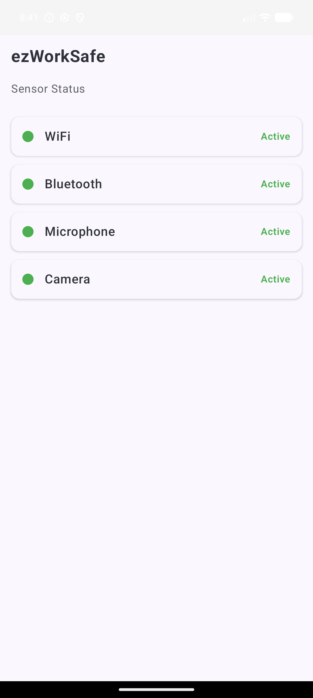
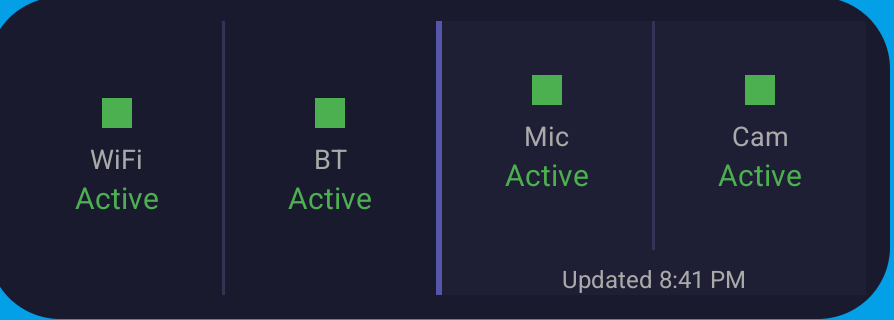
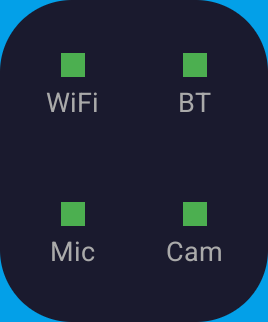

# ezWorkSafe

[](https://github.com/zeekec/ezWorkSafe/actions)
[](https://github.com/zeekec/ezWorkSafe/actions/workflows/android.yml)
[](https://codecov.io/gh/zeekec/ezWorkSafe)
[](https://github.com/zeekec/ezWorkSafe/blob/main/LICENSE)
[](https://developer.android.com/guide/topics/manifest/uses-sdk-element)
[](https://kotlinlang.org)

> ⚠️ **Personal project** — intended as a workplace privacy awareness tool, not a
> security product.

ezWorkSafe shows you at a glance whether your WiFi, Bluetooth, Microphone, and
Camera are accessible on your Android device. It's designed for workplace
privacy — verify that sensors are blocked when they should be, and know when
your mic or camera could be active.

Everything runs on-device. No data ever leaves your phone.

## Features

- **Real-time status dashboard** — open the app to see all four sensors at once
- **Home screen widgets** — two sizes: a bar widget with all sensor states and a
  compact 1×1 widget with colored dots
- **Persistent notification** — a discreet foreground notification keeps the
  service running; tapping it opens the app and refreshes mic/camera state
- **Dark mode** — automatically adapts to your system theme

## Screenshots

| App dashboard | Home screen widget | Compact widget |
|:---:|:---:|:---:|
|  |  |  |

## Widgets

Two home screen widgets show your sensor status without opening the app. The bar
widget has WiFi and Bluetooth on the left (updating in real time) and
Microphone and Camera on the right (refreshed when you open the app). The
compact 1×1 widget shows colored dots for all four sensors.

## Permissions

| Permission | When requested | Purpose |
|------------|---------------|---------|
| `RECORD_AUDIO` | App launch | Check microphone accessibility (never records) |
| `CAMERA` | App launch | Check camera accessibility (never captures) |
| `BLUETOOTH_CONNECT` | App launch (Android 12+) | Read Bluetooth on/off state |

WiFi status uses `ACCESS_WIFI_STATE`, a normal permission granted at install time.

## Quick start

```bash
./gradlew installDebug
```

Or [download the latest APK](https://github.com/zeekec/ezWorkSafe/actions/workflows/android.yml)
from the latest CI run (look for the **ezWorkSafe-release** artifact).

## For developers

See [docs/DEVELOPMENT.md](docs/DEVELOPMENT.md) for build commands, test setup,
architecture overview, and technical reference.

## License

Apache 2.0 — see [LICENSE](LICENSE).
